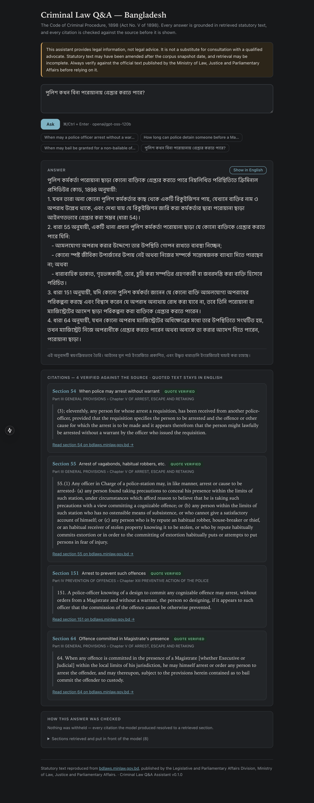
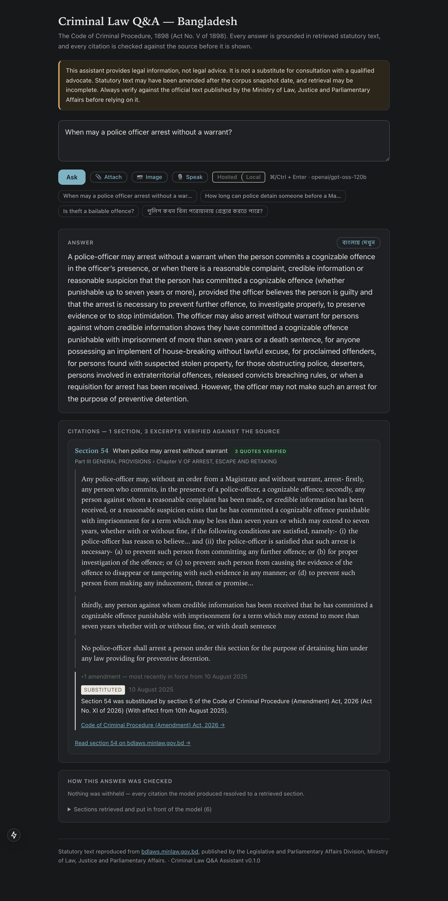
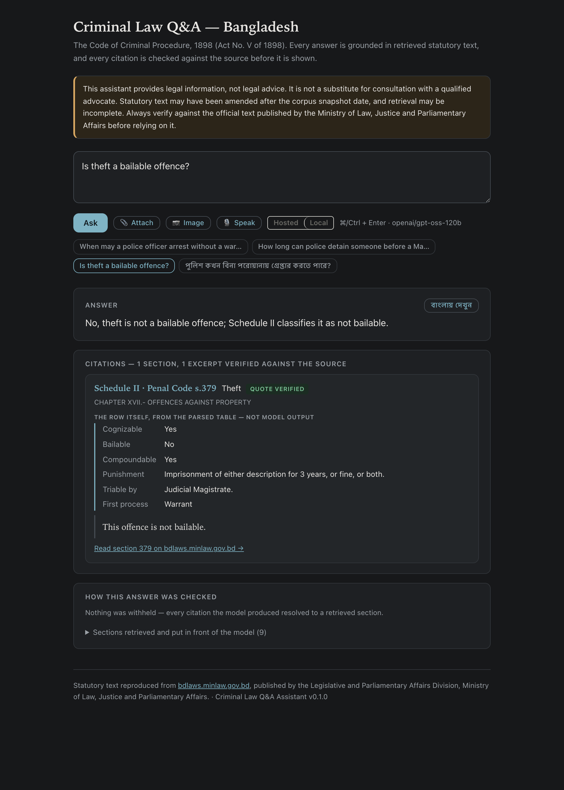
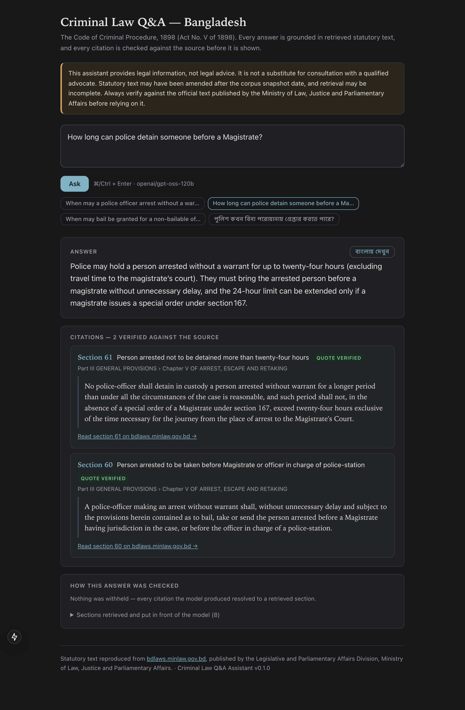
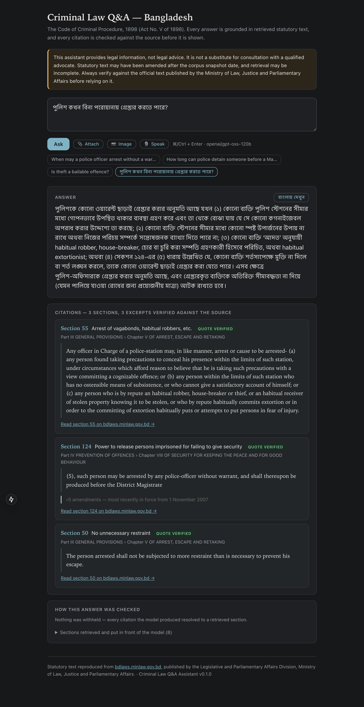
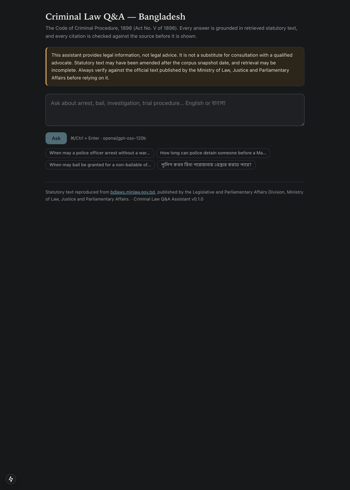
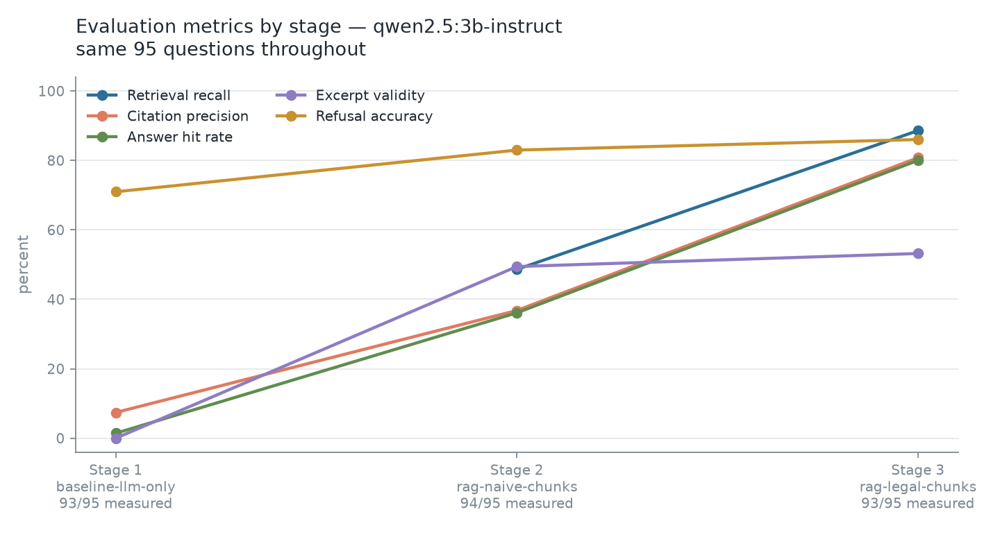
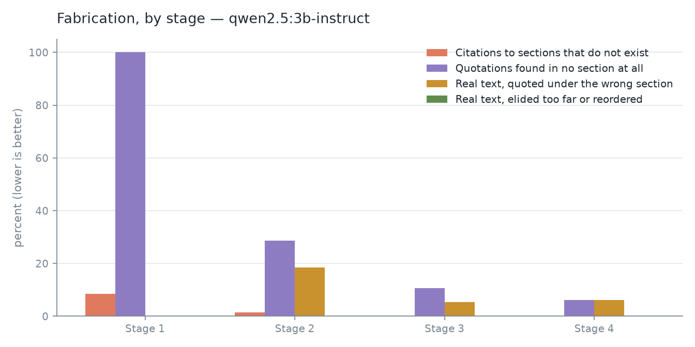

# Criminal Law Q&A Assistant

A source-grounded question-answering assistant for Bangladesh criminal law, built on the
Code of Criminal Procedure, 1898 (Act No. V of 1898) together with its amendments, its
schedules, and the related legislation the Code depends on.

Every answer is grounded in retrieved statutory text and carries section-level citations with
verbatim source excerpts. Where the corpus does not support a confident answer, the system
says so rather than producing one.

> **This system provides legal information, not legal advice.** It is not a substitute for a
> qualified advocate. Statutory text may have been amended after the corpus snapshot date,
> and retrieval may be incomplete. Verify against the official text published by the Ministry
> of Law, Justice and Parliamentary Affairs before relying on it.

## Status

**Live demo: [huggingface.co/spaces/asifuddin01/criminal-law-qa-bangladesh](https://huggingface.co/spaces/asifuddin01/criminal-law-qa-bangladesh)**

Complete and measured end to end on both models — four stages each, 101 questions, one scorer
over every run. This table is the honest state of the repository, not
a roadmap.

| Component | State |
|---|---|
| Architecture decisions | **Recorded** — 12 ADRs in [docs/adr/](docs/adr/) |
| Source survey | **Complete** — [DATA_SOURCE.md](DATA_SOURCE.md) |
| Evaluation methodology | **Defined and applied** — [eval/README.md](eval/README.md) |
| Backend service, provider abstraction | **Built and tested** — Groq and Ollama, switchable from the interface |
| Ingestion pipeline | **Built and tested** — 522 sections, 599 amendments parsed |
| Retrieval and generation | **Complete** — four stages measured end to end |
| Hosted stages 3–4 | **Complete** — 101 of 101 at both, 83.1% answer hit rate at stage 4, 0.6–1.9% of quotations fabricated |
| Corpus | CrPC (522 sections), Schedule II (376 offence rows), Penal Code (555 sections) |
| Evaluation dataset | **Built** — 101 questions, every label verified against fetched text |
| Frontend | **Delivered** — text, speech, image and document input, with verified citations |
| Speech input | **Delivered** — `whisper-large-v3`, English and Bangla |
| Image input | **Delivered** — local OCR via tesseract, English and Bengali |
| Document upload | **Delivered** — PDF and text, never treated as law |
| Amendment provenance | **Delivered** — every citation carries how and when its section changed |
| Deployment | **Live and answering** — [criminal-law-qa-bangladesh](https://huggingface.co/spaces/asifuddin01/criminal-law-qa-bangladesh), serving the interface below |
| Demo recording | **Recorded on both models** — [hosted](docs/demo.webm) and [local](docs/demo-local-model.webm), the same three questions |

## What was asked for, and what this does

Everything the brief required, including all three optional inputs.

| Required | Where it is |
|---|---|
| Q&A over a Bangladeshi legal corpus | CrPC 1898, its Schedule II, and the Penal Code 1860 |
| Answers grounded in retrieved text | Nothing is answered without retrieval; stage 1 exists to show the difference |
| Section-level citations | With verbatim excerpts, each checked against the source before display |
| Refuse when unsupported | A first-class outcome with its own metric — 90.1% refusal accuracy at stage 4 |
| Evaluation | 101 questions, eight runs — four stages on each model — one scorer over all of them |
| Documentation of approach | This file, [EXPERIMENTS.md](EXPERIMENTS.md), 12 [ADRs](docs/adr/), [AI_USAGE.md](AI_USAGE.md) |
| *Optional:* image input | tesseract OCR, English + Bengali |
| *Optional:* speech input | `whisper-large-v3`, English and Bangla |
| *Optional:* document upload | PDF and text, never treated as law |
| *Optional:* demo video **or** deployment | Both — [live Space](https://huggingface.co/spaces/asifuddin01/criminal-law-qa-bangladesh), plus recordings on [the hosted model](docs/demo.webm) and [the local one](docs/demo-local-model.webm) |

### Beyond the brief

Each of these exists because something measurable went wrong without it.

| Addition | Why |
|---|---|
| Staged evaluation, one variable per stage | A number only means something against the stage before it. |
| LLM-only baseline as a control | 143 quotations, 143 fabricated — that is what the citation check is worth. |
| Misattribution told apart from fabrication | Real text under the wrong section is a chunking bug; invented text is a model bug. |
| Two excerpt-validity rates published | Publishing the strict one means nobody has to trust my allowances. |
| Structured Schedule II lookup | "Is theft bailable?" embeds near the sections *about* bail; the row that answers it ranks nowhere. |
| The Schedule II row shown in full ([ADR 0012](docs/adr/0012-show-the-schedule-row-rather-than-a-chosen-line.md)) | A table's answer is a column. Asked about bail, the small model quoted the cognizability line — verbatim, verified, and not the answer. |
| Document roles ([ADR 0006](docs/adr/0006-document-roles-separate-operative-law-from-amending-instruments.md)) | An amending act's text is a diff, not a provision — it must never answer as law. |
| Amendment provenance on every citation | Section 54 was substituted in force from 10 August 2025; the current wording does not say so. |
| Incremental index updates | A corpus you must rebuild in full is a corpus nobody updates. |
| Bangla translation, excerpts left in English | A translated "verbatim quote" is no longer verbatim. |
| Rate-limit handling that waits or switches | A half-finished sweep biases whichever slices come last and still looks like a result. |
| [`rescore`](backend/app/evaluation/rescore.py) | Correcting the scorer should not cost a hosted budget to re-measure text that has not changed. |
| Generated screenshots | A screenshot nobody can reproduce is a claim about a version that no longer exists. |

## What it looks like

**Try it:** [criminal-law-qa-bangladesh](https://huggingface.co/spaces/asifuddin01/criminal-law-qa-bangladesh)
· **Watch it:** [hosted model](docs/demo.webm) · [local model](docs/demo-local-model.webm)

The Space serves the interface in these screenshots — the Next.js application, exported to
static files and served by the same process that serves the API. It is not a second, plainer
demo of the same pipeline; it is the same page.

The recording asks three questions, each chosen to show something different: section 54 with
the amendment that produced its current wording, *is theft bailable* answered from the
Schedule II row rather than by retrieval, and a question outside the corpus where declining
is the feature. There are two recordings, the same three questions on each model:
[the hosted one](docs/demo.webm) answers in seconds, and [the local one](docs/demo-local-model.webm)
is free and unmetered and materially weaker, so its answers are plainer and it takes visibly
longer to produce them. What is identical is everything that matters: the same retrieval, the
same citation validation, the same amendment provenance — which is the point of showing both.

Both the recording and the screenshots are generated by driving the running application
(`npm run demo`, `npm run screenshots`), not captured by hand, so they can be regenerated
whenever the interface changes. `npm run screenshots:retry` is the same capture with a wait
loop for a spent token allowance — it checks that both servers are up first, so it can tell
"wait" from "broken" instead of retrying for hours against a stopped backend.

**A Bangla question, answered and translated, with every citation verified**



The answer is translated on demand; the statutory excerpts stay in English, because
each is shown with a claim that it appears verbatim in the source and a link to check
it. Four citations, all verified, with the part and chapter each sits under.

**Every citation carries how and when the section changed**



Section 54 reads as it does because Act XI of 2026 substituted it, with effect from 10
August 2025. The current wording does not say that, and whether this section governs a
matter depends on when the matter arose. Citations group by section — three verified
excerpts from section 54 are three pieces of evidence for one provision, not three
provisions.

**A table's answer is a column, not a sentence**



Schedule II rows are indexed as prose so that *is theft bailable* retrieves them, which
leaves the model choosing which of six sentences to quote — and asked this, the local model
quoted the cognizability line: verbatim, verified, and about a different column. The columns
are parsed, so the row is shown rather than chosen
([ADR 0012](docs/adr/0012-show-the-schedule-row-rather-than-a-chosen-line.md)). The excerpt
is still there, still checked; it is now evidence beside the source rather than the only way
to see it.

**An English answer with its citations checked**



**The same question in Bangla, answered from the English corpus**



**Landing state**



## Architecture

Full diagrams and the data model: **[docs/architecture.md](docs/architecture.md)**.

Two pipelines meet at the index. Ingestion parses statutory sources into sections, amendment
records and schedule rows. Query normalizes every input modality to text, retrieves, generates,
and then passes the answer through a deterministic citation gate that can refuse it.

Three decisions shape most of the design:

**Offence classification is looked up, not retrieved.** "Is theft a bailable
offence?" embeds closest to the sections *about* bail — 496 and 497 — while the row
that decides it, Penal Code section 379 in Schedule II, ranks nowhere. Retrieval would
hand the model the general bail provisions and get a fluent, correctly cited, wrong
answer. Questions naming an offence therefore get that offence's Schedule II row placed
in front of the model directly.

**The section is the unit of citation.** Chunks never cross section boundaries, because a
citation that cannot name a section is not verifiable.
([ADR 0002](docs/adr/0002-reassemble-pages-into-legal-sections.md),
[0005](docs/adr/0005-ingest-from-single-document-print-view.md))

**Documents carry a role, and only operative law is retrievable as law.** An amending act's
text is a diff, not a provision. Indexing it flat alongside the Code lets a question about
what a section provides retrieve a 1976 ordinance's instruction to delete a word — genuine
text, resolving citation, wrong answer. The role is inferred from the document's own title;
the update path skips a non-operative act and names it, and `build` refuses one outright. The
filter is therefore at ingestion rather than at question time: an amending act's text is never
in the index to be retrieved.
([ADR 0006](docs/adr/0006-document-roles-separate-operative-law-from-amending-instruments.md))

**A section's current wording is not the whole answer.** Every citation carries the
amendments that produced it — what changed, under which act, and from what date — because a
provision substituted with effect from a date after the events being asked about is the
wrong provision for those events, and nothing in the text says so. Section 54 comes back
noting that it was substituted by Act XI of 2026 with effect from 10 August 2025.

**Modality is erased at the API boundary.** Speech, image and text converge on
`(question_text, attached_documents, language)` before retrieval, so one evaluation harness
covers every input path.
([ADR 0004](docs/adr/0004-normalize-input-modalities-at-the-boundary.md))

### Technology

| Layer | Choice |
|---|---|
| Backend | FastAPI, Python 3.12 ([why](docs/adr/0008-web-framework-choice.md)) |
| Index | Exact in-process NumPy search ([why](docs/adr/0009-exact-in-process-vector-search.md)) |
| Frontend | Next.js |
| Generation | Groq `openai/gpt-oss-120b`, Ollama `qwen2.5:3b-instruct` fallback |
| Speech | Groq `whisper-large-v3` (English and Bangla) |
| Image | tesseract OCR, local (`eng+ben`) |
| Embeddings | `paraphrase-multilingual-MiniLM-L12-v2` (ONNX) |
| Retrieval | Dense (exact, in-process) plus direct offence lookup |

Groq and Ollama both expose an OpenAI-compatible API, so one client implementation serves
both, and one credential covers generation and transcription. Providers declare
capabilities from what is actually configured: an Ollama deployment reports text-only,
and the interface hides inputs it cannot serve rather than offering controls that fail
on use.

Model identifiers are verified against the live catalogue rather than assumed —
`python -m app.llm.models` prints it and flags anything configured but missing. The
current Groq catalogue offers **no vision-capable model**, so vision is not declared and
image input needs a separate path; see [Limitations](#limitations).

Retrieval choices are provisional. They are settled by measurement in
[EXPERIMENTS.md](EXPERIMENTS.md), not by assertion here.

## Setup

Requires Python 3.12 and [uv](https://docs.astral.sh/uv/).

```bash
cd backend
uv sync --all-groups
cp .env.example .env
```

Set `GROQ_API_KEY` in `backend/.env` from [console.groq.com/keys](https://console.groq.com/keys).

To run entirely locally instead, set `LLM_PROVIDER=ollama` and pull the model:

```bash
ollama pull qwen2.5:3b-instruct
```

Ingest the corpus and build the retrieval index the application loads
(`legal_aware_schedule` — the Code, its Schedule II and the Penal Code, 1,598 chunks):

```bash
cd backend && uv run python -m app.ingest 75 11 --schedule
cd backend && uv run python -m app.retrieval.build --strategy legal_aware --act 75 --with-schedule
cd backend && uv run python -m app.retrieval.update --index legal_aware_schedule
```

`build` takes one act, so it lays down the Code and Schedule II; `update` then converges the
index on everything present in `data/raw`, which is how the Penal Code joins it. Fetching
takes two requests and one PDF; building takes about a minute.

Run the API:

```bash
cd backend && uv run uvicorn app.main:app --port 8010 --reload
```

- Interactive API docs: `http://localhost:8010/docs`
- Liveness: `GET /api/health` — deliberately does not touch the model provider
- Capabilities: `GET /api/meta?probe=true` — active provider and what it supports
- Ask: `POST /api/ask` with `{"question": "...", "language": "en"}`

Run the web client, in a second terminal:

```bash
cd frontend && npm install && npm run dev
```

Then open `http://localhost:3000`.

Tests:

```bash
cd backend && uv run pytest
```

Useful checks:

```bash
cd backend && uv run python -m app.llm.models
```

prints the provider's live model catalogue and flags anything configured but missing —
model identifiers differ between accounts and a stale one fails every request while
looking like a credential problem.

## Deploying

The frontend exports to static files served by the API process, so a deployment is one
container on one port. Steps, limits and the local `docker run`:
**[docs/DEPLOY.md](docs/DEPLOY.md)**.

```bash
./deploy/push-to-space.sh <hf-username> <space-name>
```

The API key goes in the host's own secrets page, never in the repository.

**What the free tier costs, stated up front:** one shared token allowance is about 60
questions a day before the Space says so and recovers, and the optional local model is
re-fetched on every cold start — 3.3 GB — then answers in minutes on two shared vCPUs. The
full table is in [docs/DEPLOY.md](docs/DEPLOY.md). None of it affects the evaluation, which
runs locally.

Docker Spaces, and on some accounts CPU-basic hardware, are gated behind a paid tier, so the
Space runs under the `gradio` SDK on ZeroGPU hardware — which allocates a GPU only inside
`@spaces.GPU` calls, and this application never makes one. **The interface it serves is this
project's own**, not Gradio's: the Next.js application exports to static files, so the Space
serves the page and the API from one process on one origin, the same arrangement the
container uses. Gradio's Blocks are still built and launched, because ZeroGPU will not start
a Space that declares no `@spaces.GPU` function and only `launch()` reports one — its
interface stays behind as the fallback, served at the root if the export is ever missing.
The `Dockerfile` is still there and is still the better option wherever Docker Spaces are
available; it is built and verified for `linux/amd64`.

Cold start is 21 seconds, down from 59 before Schedule II was precomputed ahead of time:
81% of the original startup was re-parsing a 161-page PDF that never changes, on every wake
of a Space that sleeps when idle.

## Data ingestion and update

Sources, structure and provenance: **[DATA_SOURCE.md](DATA_SOURCE.md)**.

The corpus comes from `bdlaws.minlaw.gov.bd`, published by the Legislative and Parliamentary
Affairs Division. Three source shapes:

| Shape | Endpoint | Handling |
|---|---|---|
| Whole act | `act-print-<id>.html` | One request per act. Segmented by section marker; footnotes parsed into amendment records. CrPC and the Penal Code are ingested |
| Schedule | `upload/act/…Schedule-II.pdf` | 161-page PDF, extracted into 376 structured offence rows |
| Amending acts | Individual acts | Ingested with role `amending`, excluded from retrieval as law |

Membership follows a stated criterion rather than intuition: an act is in scope if CrPC
incorporates it by normative reference, or if it displaces CrPC procedure via a non-obstante
clause ([ADR 0007](docs/adr/0007-inclusion-criterion-for-related-laws.md)).

**Updating.** The index converges on whatever sources are present in `data/raw`, so adding
an act, replacing one with a newer consolidation, and removing one are the same operation:

```bash
cd backend && uv run python -m app.retrieval.update --index legal_aware_schedule --dry-run
cd backend && uv run python -m app.retrieval.update --index legal_aware_schedule
```

Chunks are matched on a stable id and compared on a hash of their text, so only new or
altered chunks are embedded. A source republished with one provision amended re-embeds one
provision.

Name the index every time, and dry-run the one you are about to change rather than a
sibling. The update reads that index's own chunking strategy and document set off its
chunks — `naive_fixed_size` over the Code alone stays that, and is not converged onto the
full corpus because another index holds it. An operation that would add and remove more
than a quarter of an index is refused as a rebuild in disguise, since the runs already
recorded against an index stop being comparable the moment it changes shape underneath
them.

**Demonstration** ([transcript](docs/incremental-update-demo.txt)):

```bash
cd backend && uv run python -m app.retrieval.demo
```

| Operation | Embedded | Reused | Time |
|---|---|---|---|
| Full build, Code only | 621 of 621 | — | 20.5 s |
| Add Schedule II (376 rows) | 376 of 997 | 62% | 14.9 s |
| Amend one section | **1 of 997** | **99.9%** | 0.1 s |

Those three rows are what the linked transcript records, and it is regenerated by running the
command rather than written by hand. The Penal Code was added the same way but through the
production CLI rather than the demo: **601 chunks from its 555 sections, 601 of 1598 embedded,
62% reused**, taking the corpus from 997 to 1598 chunks while the existing 997 kept the
vectors they already had. That run is recorded in [EXPERIMENTS.md](EXPERIMENTS.md).

Each addition is followed by an evaluation run, so an act that degrades retrieval on core
CrPC questions is detected rather than presumed harmless.

## Evaluation

Metrics, dataset schema and construction protocol: **[eval/README.md](eval/README.md)**.

The same dataset runs after every stage, so each change is attributable to a movement in a
number and a change that moves nothing is recorded as such. Every reported metric is
deterministic — no model is asked whether another model was honest. A faithfulness metric
scored by an LLM judge was specified early and deliberately not built; the reasoning, and
the gap it leaves, are in [eval/README.md](eval/README.md).

The dataset is stratified — direct lookup, multi-section, amended provisions, unanswerable,
ambiguous, Bangla. The unanswerable and ambiguous slices are not padding: a system tuned only
on answerable questions reliably learns to always answer.

Gold section labels are verified against fetched act text, never recalled. A wrong gold label
penalises correct retrieval and rewards incorrect retrieval, invisibly.

## Experiments and results

Running log with hypotheses, configurations, results and decisions:
**[EXPERIMENTS.md](EXPERIMENTS.md)**. Charts and the full table:
[eval/runs/charts/](eval/runs/charts/).

Four stages, each adding exactly one thing to the one before, measured on the same frozen
gold set so any movement is attributable:

| Stage | What changes |
|---|---|
| 1 — LLM only | No retrieval. Establishes what the model invents unaided. |
| 2 — naive chunks | Dense retrieval over fixed-size windows that ignore section boundaries. |
| 3 — legal-aware chunks | The same pipeline, chunked on the section — the unit of citation. |
| 4 — full corpus | Schedule II and the Penal Code added, plus structured offence lookup. |

The stage 1 baseline is not a formality. It is the control that makes the excerpt check
meaningful: quoting from memory with no text in front of it, **not one of its quotations is
real**, on either model. Every later stage is measured against that.

Complete on the local model, 101 of 101 questions measured at every stage, one scorer over
every run:

| Stage | Retrieval recall | Citation precision | Answer hit rate | Excerpt validity | Refusal accuracy |
|---|---|---|---|---|---|
| 1 — LLM only | n/a | 6.9% | 1.3% | **0.0%** | 73.3% |
| 2 — naive chunks | 63.6% | 61.2% | 48.0% | 52.9% | 90.1% |
| 3 — legal-aware chunks | 80.5% | **66.3%** | **63.6%** | 83.9% | 88.1% |
| 4 — full corpus + offence lookup | **81.8%** | 59.1% | 61.0% | **87.5%** | **90.1%** |



A quotation that fails is two different failures, and they have opposite fixes. Real
statutory text quoted under the wrong section is a chunking defect — a window that crosses a
section boundary contains another section's words, and the model quotes it honestly. Text
found in no section at all is the model writing law. Added together they hide each other:



| Stage | Verified | Real text, wrong section | In no section at all |
|---|---|---|---|
| 1 — LLM only | 0.0% | 0.0% | **100.0%** |
| 2 — naive chunks | 52.9% | **18.6%** | 28.6% |
| 3 — legal-aware chunks | 83.9% | **5.4%** | 10.8% |
| 4 — full corpus | 87.5% | 6.2% | **6.2%** |

Misattribution is what chunking on section boundaries fixes: 18.6% to 5.4%, from that one
change. Fabrication is what retrieval fixes, falling at every stage from 100%.

Stage 4 is recorded as a trade, not an improvement. Citation precision falls — a thousand
more chunks compete for the same eight retrieval slots — and what is bought is the ability
to answer offence-classification questions at all, the lowest fabrication rate of any stage,
and the best refusal accuracy. Act-aware ranking is the obvious response and is not built.

The hosted model (`openai/gpt-oss-120b`) has completed all four stages. At stages 3 and 4 it
retrieves exactly what the local model retrieves — the same index, 80.5% and 81.8% recall —
and does more with it: 79.3% citation precision against 66.3% at stage 3, an 83.1% answer hit
rate against 61.0% at stage 4, and near-zero misattribution throughout (0.0% against 5.4% and
6.2%) where the local model quotes one section's words under another's. It refuses slightly
less readily than the local model when it should. The prompt is not identical across the two
tracks — the local sweep predates the rule asking for short quotations — so the gap is the
model and that rule together. Costs, the per-slice breakdown and the hosted model's own
weakness (quotations elided past the point of being evidence) are in
[EXPERIMENTS.md](EXPERIMENTS.md#hosted-stages-3-and-4).

## Limitations

Stated now rather than discovered later.

**No point-in-time reconstruction.** The system reports when a provision changed, under
which act and from what date, and links the amending act — but it does not reconstruct the
text as it stood on a past date. bdlaws publishes
only the current consolidation, and the footnotes do not always preserve replaced wording in
full. Approximating this would be worse than declining it.

**English corpus.** Bangla questions are supported against English statutory text. The Bangla
texts on bdlaws are not yet ingested, so answers and quoted excerpts are in English.

**Translation quality depends on the model, and the local fallback is not good
enough for it.** Answers can be translated into Bangla on demand. The hosted model
produces sound legal Bangla; `qwen2.5:3b-instruct` produces text a Bangla reader would
find wrong in places, inventing phrases that are not Bengali legal terms. The feature
is therefore usable on the hosted provider and should be treated as unavailable on the
local one. Statutory excerpts are never translated in either case — see
[the translation module](backend/app/qa/translate.py) for why.

**Prose that misreads a correct quotation is not measured.** Every reported metric is
deterministic, which is a strength and also a boundary. The checks establish that a cited
section exists, that retrieval put it in front of the model, and that a quoted excerpt is
the section's own words. They do not establish that the surrounding sentences characterise
that excerpt correctly. An answer that quotes section 54 accurately and then describes it
wrongly passes every check here. Measuring it needs either a calibrated judge or manual
scoring, and the reasoning for taking neither is in [eval/README.md](eval/README.md).

**Case law is out of scope.** The corpus is statutory. Judicial interpretation frequently
determines how a provision operates in practice, and none of it is here.

**Consolidation lag.** The corpus is only as current as bdlaws. A recent amendment not yet
reflected there will not be reflected here.

**Not a substitute for advice.** The system is designed to be verifiable, not authoritative.
Every citation links back to the official source precisely so that a user can check it.

## Future improvements

Ingest the Bangla texts for bilingual excerpts. Extend the corpus under the ADR 0007
criterion. Investigate act-aware retrieval ranking, which becomes a real problem once general
and special provisions on the same subject compete for the same query.

Hybrid retrieval — BM25 fused with dense by reciprocal rank — was planned as stage 4 and
replaced by structured offence lookup, which addressed the question that motivated it more
directly. It is untried rather than rejected, and remains the obvious next retrieval
experiment.

## Documentation

| Document | Contents |
|---|---|
| [docs/architecture.md](docs/architecture.md) | Diagrams, data model, technology choices |
| [docs/DEPLOY.md](docs/DEPLOY.md) | Deployment steps, free-tier limits, running the container |
| [DATA_SOURCE.md](DATA_SOURCE.md) | Corpus provenance and source structure findings |
| [EXPERIMENTS.md](EXPERIMENTS.md) | Experiment log |
| [eval/README.md](eval/README.md) | Evaluation methodology |
| [AI_USAGE.md](AI_USAGE.md) | AI tooling, delegation, review, rejected suggestions |
| [docs/adr/](docs/adr/) | Architecture decision records |

## Attribution

Statutory text is reproduced from [bdlaws.minlaw.gov.bd](https://bdlaws.minlaw.gov.bd),
published by the Legislative and Parliamentary Affairs Division, Ministry of Law, Justice and
Parliamentary Affairs, Government of Bangladesh.
