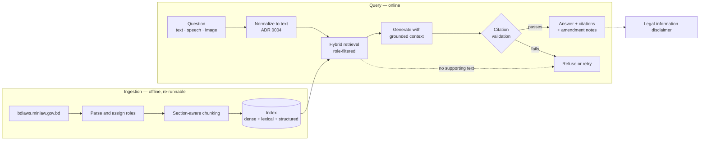
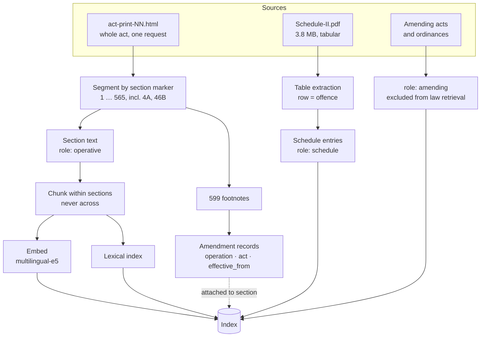
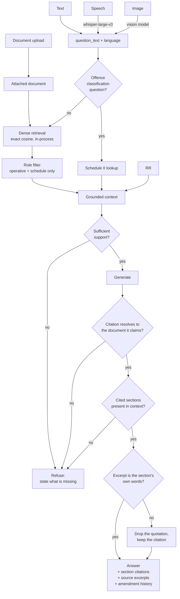
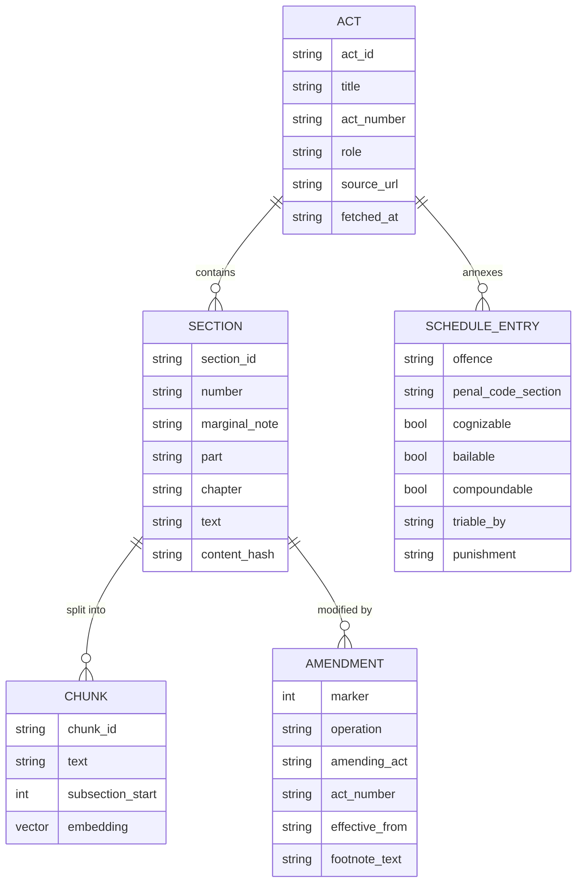

# Architecture

Diagrams are Mermaid so they live in version control and change with the code, rather than
becoming a stale image exported once.

Legend: solid arrows are the request path; dashed arrows are checks and metadata.

## 1. System overview

Two pipelines meet at the index. Ingestion is offline and re-runnable; query is online.

The gate is the load-bearing part. Everything upstream improves the *odds* of a grounded
answer; the gate is the only component that can refuse to emit an ungrounded one.

## 2. Ingestion

Three source shapes, three roles, one index. See
[ADR 0006](adr/0006-document-roles-separate-operative-law-from-amending-instruments.md).

A chunk never crosses a section boundary, because the section is the unit of citation. Long
sections split at subsection boundaries with the section header repeated, so every chunk
carries the identity needed to cite it.

Schedule II is extracted as rows rather than prose. A chunk spanning a row boundary would
silently attribute one offence's bailability to another.

## 3. Query

A verified citation is returned with the amendments attached to its section — operation,
footnote text, amending act and effective date, most recent first. Those records come from
the footnote apparatus parsed at ingestion and are tied to their location in the text by
footnote marker.

All three validation checks are deterministic. None asks a model whether it was honest. The
first resolves a citation against the document it names, because section numbers repeat
across acts — Penal Code section 379 is theft, Code of Criminal Procedure section 379 is
about appeals, and resolving one against the other would confirm a wrong citation as readily
as a right one. The second is a set membership test against what retrieval actually
returned. The third is a string containment test against stored source text.

A failed quotation drops the quotation and keeps the citation: a fabricated excerpt is worse
than none, while the section reference may still be sound. What "the section's own words"
means is not quite a raw substring test, and the difference is worth stating precisely —
bdlaws' amendment brackets are canonicalised away, an ellipsis is read as an elision, and a
citation label the model copied in front of the text is trimmed off before the remainder is
required to match. None of those admits a word the section does not contain, and the reasons
are in [ADR 0011](adr/0011-what-counts-as-a-verbatim-quotation.md). Both the repaired and the
strict rate are published for every stage.

Refusal is a first-class outcome with its own accuracy metric, not an error path.

## 4. Corpus data model

`content_hash` on the section is what makes incremental update cheap: re-ingesting an act
re-embeds only sections whose hash changed.

## Technology choices

| Layer | Choice | Reason |
|---|---|---|
| Backend | FastAPI, Python 3.12 | Async, typed, first-class OpenAPI. Alternatives examined in [ADR 0008](adr/0008-web-framework-choice.md) |
| Frontend | Next.js | Straightforward deploy. Answers are **not** streamed, and cannot be: the citation gate has to see a complete answer before any of it is shown, or the interface would stream text and then retract a citation that failed validation |
| Generation | Groq free tier, Ollama fallback | One key covers text, speech and vision; local path keeps the demo alive offline. [ADR 0003](adr/0003-llm-provider-strategy.md) |
| Embeddings | multilingual MiniLM (ONNX) | Bangla questions against English text. [ADR 0010](adr/0010-embedding-model.md) |
| Retrieval | Dense, plus structured offence lookup | Hybrid retrieval was the plan; the question it was for — "is theft bailable?" — is answered by looking the offence up in Schedule II by name, not by lexical overlap. See the progression note in [EXPERIMENTS.md](../EXPERIMENTS.md) |
| Index | Exact in-process NumPy search | Corpus is thousands of chunks, not millions; exact search removes a confound from the chunking experiments. [ADR 0009](adr/0009-exact-in-process-vector-search.md) |

Retrieval choices are provisional and settled by measurement, not assertion — see
[EXPERIMENTS.md](../EXPERIMENTS.md).
